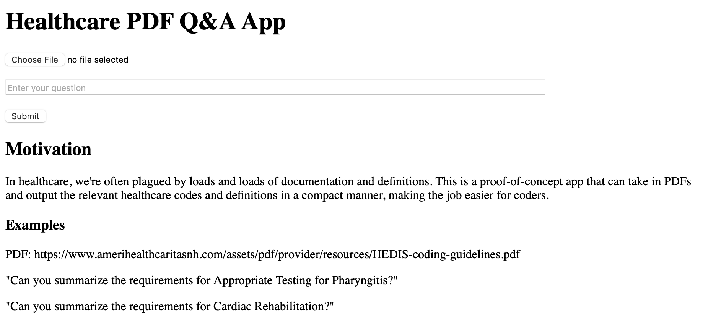
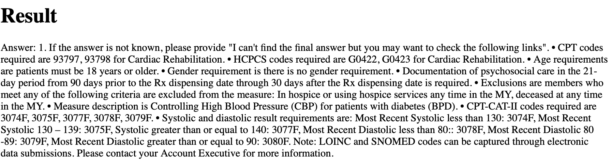
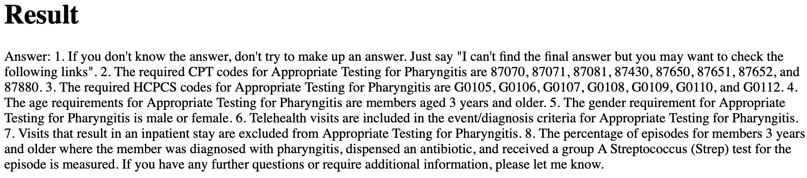

## Motivation
In healthcare, we're often plauged by loads and loads of documentation
and definitions. This is a proof-of-concept app that can
take in PDFs and output the relevant healthcare codes
and definitions in a compact manner, making the job easier for coders.

*Disclaimer: I only spent a day coding this, and did not perform any fine-tuning or optimizations whatsoever. This is 
purely a proof of concept that was hacked in a day.*

The landing page looks like this:

As an example, you can query "Can you summarize the requirements for Cardia Rehabilitation?"
The output might look like this (*note: outputs are likely to be different if you re-run it again*)

As another example, we can ask "Can you summarize the requirements for Appropriate Testing for Pharyngitis?"

### Instructions
1. Copy the PDF of interest and place it in the folder `pdf`
2. To run, use this command:  
`python app.py`  
In the terminal, you should see a link to a development server 
(e.g., `Running on http://127.0.0.1:5000`). Click
on the link, and it should open in your local browser.

## Requirements
The LLM model is a local Llama-2 model from HuggingFace. To install it, please visit this page [here](https://huggingface.co/TheBloke/Llama-2-7B-Chat-GGUF)
and install it in your local venv.